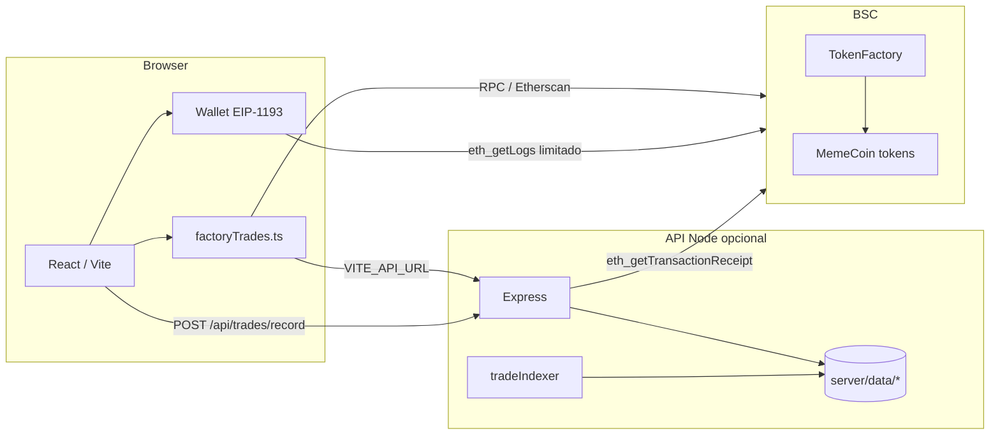

# Tota Vault Launchpad — Arquitetura

Documentação da arquitetura do repositório **até o estado atual**: frontend (Vite + React), API Node opcional, contratos Solidity (BNB Chain / BSC), e fluxos de dados on-chain e em disco.

---

## 1. Visão geral

| Camada | Tecnologia | Função |
|--------|------------|--------|
| **UI** | React 18, TypeScript, Vite 5, Tailwind | DApp: listagem de tokens, criação, detalhe, gráfico, compra/venda na bonding curve |
| **Wallet** | `ethers` v6, `Web3Context` (EIP-1193) | MetaMask / extensões; BSC chain id `56` |
| **API de leitura** | Express 5, Node (`server/index.mjs`) | Lista de tokens, trades agregados, rocket; persistência em disco na VPS |
| **Contratos** | Hardhat, Solidity | `TokenFactory`, `MemeCoin`, `BurnAgent`, `TotaVaultLocked` |
| **Chain alvo** | BNB Smart Chain (mainnet) | Endereços em `src/contracts/contractAddresses.ts` |

O build de produção do front é **estático** (`vite build` → `dist/`). O servidor Node **não** é empacotado no `build`; corre como processo separado (local ou VPS).

---

## 2. Estrutura de pastas (alto nível)

```
├── contracts/              # Solidity + scripts Hardhat (deploy-full.cjs, etc.)
├── server/                 # API Express (leitura BSC + cache em disco)
│   ├── index.mjs           # Rotas HTTP, CORS, arranque do indexador
│   ├── tradesService.mjs   # Merge incremental + scan Etherscan/BscScan/RPC
│   ├── recordTradeFromTx.mjs  # POST: valida 1 tx na factory e grava disco
│   ├── tradeIndexer.mjs    # Loop opcional: avança blocos na factory
│   ├── tradeDiskCache.mjs  # JSON por token + log .jsonl
│   ├── tokensService.mjs   # Lista tokens a partir da factory
│   ├── etherscanTrades.mjs # getLogs via APIs públicas
│   └── data/               # (gitignored) trades-cache, indexer-state, etc.
├── src/
│   ├── App.tsx             # Rotas por estado + `window.history` (/token/0x…)
│   ├── context/Web3Context.tsx
│   ├── hooks/              # useContracts, useFactoryEvents, useWeb3, …
│   ├── components/           # TokenDetail, PriceChart, CreateTokenForm, …
│   ├── utils/              # factoryTrades, recordTrade, homeFeed, queryFilterChunked
│   └── contracts/          # ABI snippets + TOKEN_FACTORY address
├── artifacts/              # ABI JSON (Hardhat compile)
└── public/                 # Assets estáticos
```

---

## 3. Fluxo da aplicação (frontend)

- **`App.tsx`**: views `home | create | detail | faq | terms | lock | factory`; URL espelha a view (`/create`, `/token/:addr`, `/factory`, …).
- **`Web3Context`**: expõe `provider` (`BrowserProvider`), `signer`, `account`, `chainId`; exige BSC para operação correta.
- **`useContracts`**: interação com `TokenFactory` e tokens — `createToken`, `buyToken`, `sellToken`, leituras `tokenInfo`, `bondingCurves`, etc. Após `buy`/`sell` confirmado, chama **`pushTradeToBackend`** (`src/utils/recordTrade.ts`) se `VITE_API_URL` estiver definido.
- **`TokenDetail` + `useFactoryEvents`**: histórico de trades da **bonding curve** (eventos `TokenPurchased` / `TokenSold` na factory). Pode receber `provider` da wallet para leituras complementares no gráfico (`PriceChart` + `readProvider`).
- **`factoryTrades.ts`**: ponto único para carregar trades no browser — ver secção 5.

Rotas “só leitura” do Hero/ticker usam `useGlobalTrades` / `homeFeed.ts` (RPC curto ou JSON remoto opcional).

---

## 4. API Node (`server/`)

Servidor HTTP (porta padrão **8787**). Variáveis em `.env` na raiz (carregadas por `dotenv` no Node).

| Método | Rota | Descrição |
|--------|------|-----------|
| `GET` | `/health` | Saúde do serviço |
| `GET` | `/api/tokens` | Lista tokens da factory (com cache em memória) |
| `GET` | `/api/trades/:token` | Trades agregados por endereço de token; usa disco + merge incremental |
| `POST` | `/api/trades/record` | Corpo: `{ tokenAddress, txHash }` — lê o recibo na chain, extrai eventos da factory, grava em `server/data/trades-cache/` |
| `GET` | `/api/rocket/config` | Config do contrato “rocket” (se existir) |
| `GET` | `/api/rocket/score/:token` | Score por token |

**Indexador (`tradeIndexer.mjs`)**: opcional (`TRADE_INDEXER_ENABLED=0` desliga). Avança `indexer-state.json` e aplica logs da factory em disco. **Bind**: `BIND_HOST=127.0.0.1` local; `0.0.0.0` atrás de reverse proxy na VPS.

---

## 5. Fluxo de dados — trades (gráfico / lista)

### 5.1 O que é um “trade” aqui

Apenas negociações pela **curva na `TokenFactory`** (`buyToken` / `sellToken`), identificadas pelos eventos **`TokenPurchased`** e **`TokenSold`**. Swaps na Pancake **depois da graduação** não entram nesse feed (são outro mercado).

### 5.2 Browser (`src/utils/factoryTrades.ts`)

Ordem de resolução **atual**:

1. **`VITE_API_URL` definido** → `GET /api/trades/:token` (prioridade; evita `getLogs` massivo na MetaMask).
2. Sem API ou com fallback permitido → se houver **`readProvider` (wallet)** → `eth_getLogs` via wallet com **janela limitada** (por defeito ~80k blocos; `VITE_WALLET_FACTORY_LOG_LOOKBACK_BLOCKS`).
3. **Etherscan API V2** (se `VITE_ETHERSCAN_API_KEY` e falhas anteriores).
4. **RPC público** (`VITE_BSC_RPC_URL` ou seed Binance).

Cache em memória no front separa modo “com wallet” / “sem wallet” (`:w` / `:p` nas chaves internas).

### 5.3 Servidor (`tradesService.mjs` + `tradeDiskCache.mjs`)

- Ficheiros **`server/data/trades-cache/<token>.json`**: array `trades` + `lastScannedBlock` (v2) para merge incremental.
- **`server/data/trades-storage/factory-trades.jsonl`**: linhas append-only para auditoria.
- Scan ao vivo: Etherscan V2 → fallback BscScan (`BSCSCAN_API_KEY`) → RPC (`BSC_RPC_URL`, com fallback para seed se Alchemy limitar `getLogs`).

### 5.4 Gravação explícita após UI

`POST /api/trades/record` valida **uma transação** pelo hash (recibo on-chain) e faz merge no mesmo JSON em disco — não substitui o scan completo, complementa confiança e UX após compra/venda pela app.

---

## 6. Contratos (Solidity)

| Contrato | Papel resumido |
|----------|------------------|
| **`TokenFactory`** | Cria `MemeCoin`, bonding curve, taxas, graduação para DEX, eventos de compra/venda |
| **`MemeCoin`** | Token com taxas DEX, anti-bot, dividendos opcionais, etc. |
| **`BurnAgent` / `TotaVaultLocked`** | Utilitários de burn / lock conforme deploy |

Endereço da factory no front: **`src/contracts/contractAddresses.ts`** (`TOKEN_FACTORY`). Deve coincidir com o deploy real e com `TOKEN_FACTORY` no servidor se sobrescreveres o default.

---

## 7. Variáveis de ambiente (resumo)

| Variável | Onde | Uso |
|----------|------|-----|
| `VITE_API_URL` | Front | Base URL da API (`/api/trades`, etc.) |
| `VITE_BSC_RPC_URL` | Front | RPC BSC para leituras sem depender só do seed público |
| `VITE_ETHERSCAN_API_KEY` | Front | Etherscan API V2 (chainid 56) |
| `VITE_FACTORY_DEPLOY_BLOCK` | Front | Reduz intervalo de scan |
| `VITE_WALLET_FACTORY_LOG_LOOKBACK_BLOCKS` | Front | Limite de blocos ao usar RPC da wallet (sem API) |
| `BSC_RPC_URL`, `BSCSCAN_API_KEY`, `TOKEN_FACTORY`, `FACTORY_DEPLOY_BLOCK` | Servidor | Scans e endereço da factory |
| `PORT`, `BIND_HOST` | Servidor | Porta e interface de escuta |
| `TRADE_INDEXER_ENABLED` | Servidor | `0` desliga o indexador em background |

Lista mais completa: **`.env.example`** na raiz.

---

## 8. Scripts NPM

| Comando | Descrição |
|---------|-----------|
| `npm run dev` | Só Vite (dev server) |
| `npm run server` | Só API Node (`server/index.mjs`) |
| `npm run dev:full` | API + Vite em paralelo (`concurrently`) |
| `npm run build` | Build de produção do front → `dist/` |
| `npm run compile` | `hardhat compile` |
| `npm run deploy:bsc` | Deploy (script `contracts/deploy-full.cjs` na rede `bsc`) |

---

## 9. Deploy (referência)

- **Front estático**: Netlify / Vercel / Cloudflare Pages — `npm run build`, pasta `dist`; definir `VITE_*` no painel.
- **API**: máquina com Node (VPS, Railway, Render, …) — `node server/index.mjs` ou PM2; `VITE_API_URL` no front aponta para `https://api.teudominio.com`.
- **Secrets**: chaves RPC e explorers no servidor e/ou CI, nunca commitadas.

---

## 10. Holders (UI)

Na aba **Holders** do `TokenDetail`, os “holders” são uma **estimativa** derivada dos trades da factory (soma compras − vendas por endereço). Não é um indexer de todos os `Transfer` on-chain nem saldos reais pós-DEX.

---

## 11. Diagrama lógico (mermaid)



---

## 12. VPS + Hardhat **sem** Etherscan / BscScan (só RPC)

### O que o Hardhat faz (e o que não faz)

| Ferramenta | Função |
|------------|--------|
| **Hardhat** | Compilar contratos, testes, **deploy** (`hardhat run`, redes em `hardhat.config`). Corre no teu PC ou na VPS **quando precisas** de novo bytecode na chain. |
| **Não é** | Um substituto da API do Etherscan. O Hardhat **não** indexa histórico nem serve `getLogs` HTTP para o browser em produção. |

Para **eliminar dependência de APIs de terceiros** (Etherscan, BscScan), o runtime da app usa **JSON-RPC** para leitura: `eth_getLogs`, `eth_getTransactionReceipt`, `eth_call`, etc. Isso implica um **endpoint RPC** estável.

### O que pões na VPS (recomendado)

1. **Node da API** — `npm run server` (ou PM2) com `BIND_HOST=0.0.0.0` atrás de Nginx/Caddy com HTTPS.
2. **Mesmo `.env` na raiz** (ou variáveis no painel) com:
   - **`BSC_RPC_URL`** — URL HTTPS de um nó BSC com bons limites de `eth_getLogs` (podes usar **nó próprio**, ou um endpoint RPC que contrates; o seed público da Binance costuma rate-limitar em scans longos).
   - **Não definir** `BSCSCAN_API_KEY`, `VITE_ETHERSCAN_API_KEY`, `ETHERSCAN_API_KEY` — o servidor e o browser caem no fluxo **só RPC** (já suportado em `tradesService.mjs` e `factoryTrades.ts`).
   - **`FACTORY_DEPLOY_BLOCK`** / `FACTORY_LOG_LOOKBACK_BLOCKS` — reduzem trabalho do RPC em scans.
   - **`TOKEN_FACTORY`** — se o deploy não for o default do código.
3. **Front** — `npm run build`, servir `dist/` (Nginx) ou hospedar noutro sítio; **`VITE_API_URL=https://api.teudominio.com`** apontando para a API na mesma VPS.
4. **`VITE_BSC_RPC_URL`** — mesmo URL (ou outro RPC só leitura) para fallback no browser quando não há API ou para leituras diretas.

### Hardhat na VPS (só para contratos)

Usa Hardhat **apenas** quando fores **compilar ou fazer deploy** de contratos a partir do repositório:

```bash
npm ci
npm run compile
# com PRIVATE_KEY e rede configurada em hardhat.config:
npm run deploy:bsc
```

A `PRIVATE_KEY` e chaves de verificação de contrato ficam **no servidor de deploy**, não em variáveis `VITE_*` (não vão para o browser).

### Resumo

- **Sem APIs de explorers** → **sim**, deixando as chaves vazias e configurando **`BSC_RPC_URL` + API Node + disco** em `server/data/`.
- **Hardhat** → **deploy/compile**, não substitui o indexador; o “indexador” aqui é **RPC + servidor Node** (merge incremental + `POST /api/trades/record`).

---

## 13. Front noutro sítio + RPC na VPS (`http://IP:8545`)

É normal o **site** estar no PC, Netlify, etc., e o **nó JSON-RPC** (ou a API Node) estarem numa **VPS** com IP público.

### No servidor que corre `npm run server` (pode ser a própria VPS ou outra máquina)

Define no `.env` (ou variáveis de ambiente):

```env
BSC_RPC_URL=http://SEU_IP:8545
```

O Node **não** sofre com CORS; só precisa de **rede** até à porta `8545` (firewall: abrir só para o IP do servidor da API, se não for o mesmo host).

### No teu PC / build do front (`VITE_*`)

```env
VITE_BSC_RPC_URL=http://SEU_IP:8545
```

**Atenção:**

1. **Site em HTTPS** (Netlify, Vercel, domínio com SSL): o browser **bloqueia** pedidos `http://` para o RPC (**mixed content**). Soluções: pôr o RPC atrás de **HTTPS** (Nginx/Caddy com certificado no domínio ou só IP com TLS), ou usar **só** a API Node para leituras (ver abaixo).
2. **CORS**: muitos nós (Geth, Erigon, etc.) **não** enviam `Access-Control-Allow-Origin`. O **ethers no browser** pode falhar ao falar direto com `http://IP:8545`, mesmo em HTTP. De novo: **API Node no meio** ou proxy com CORS.
3. **Configuração mais estável**: define **`VITE_API_URL=https://…`** para o teu Express (na VPS, atrás de HTTPS). O gráfico/trades vêm do **`GET /api/trades`** e o servidor usa **`BSC_RPC_URL`** para falar com o nó — o browser **não** precisa de `VITE_BSC_RPC_URL` para esse fluxo. Usa `VITE_BSC_RPC_URL` só como fallback quando não há API ou para leituras pontuais.

### Resumo prático

| Onde | Variável | Exemplo |
|------|----------|---------|
| Máquina da API Node | `BSC_RPC_URL` | `http://IP_DA_VPS:8545` |
| Build do front (local ou Netlify) | `VITE_API_URL` | `https://api.teudominio.com` (recomendado) |
| Front (opcional) | `VITE_BSC_RPC_URL` | Só se o site for **HTTP** ou o RPC tiver **HTTPS + CORS** |

Não commits o IP real no Git; usa `.env` local / secrets do painel de deploy.

---

Para detalhes operacionais do backend, o projeto também referencia **`BACKEND.md`** (se existir na raiz). Este README descreve a arquitetura; ajusta endereços e env sempre que fizeres novo deploy da factory ou mudares de rede.
